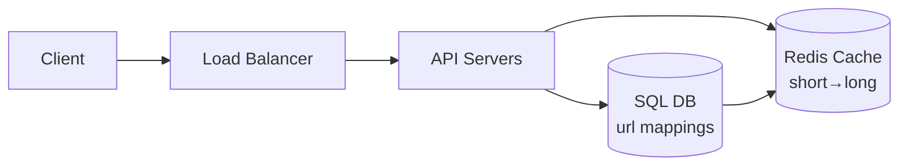

# System Design Basics

> Every large system you use today — Google Search, Instagram, WhatsApp — started as a set of decisions made on a whiteboard. This article covers the foundational concepts you need to think clearly about those decisions.

---

## What is System Design?

System design is the process of defining the architecture, components, and data flow of a system to satisfy a set of requirements. It operates at two levels:

- **High-Level Design (HLD)** — the big picture: services, databases, APIs, and how they connect.
- **Low-Level Design (LLD)** — the detail: class structures, algorithms, data schemas.

Most engineering interviews and real-world architectural decisions live at the HLD level. That's where we'll focus.

---

## The Core Requirements

Before drawing a single box, answer two questions:

### Functional Requirements
*What does the system do?*
- Users can upload photos
- The system sends notifications in real time
- Search returns results in under 200ms

### Non-Functional Requirements
*How well does it do it?*

| Property | Question it answers |
|---|---|
| **Scalability** | Can it handle 10× the load? |
| **Availability** | Is it up when users need it? |
| **Consistency** | Does every user see the same data? |
| **Latency** | How fast does it respond? |
| **Durability** | Is data safe even if a server dies? |

These properties trade off against each other. You cannot have all of them at maximum simultaneously — this is the core tension of system design.

---

## Scaling: Vertical vs Horizontal

### Vertical Scaling (Scale Up)
Add more power to a single machine — more CPU, more RAM, faster disk.

**Pros:** Simple, no code changes needed.
**Cons:** Hard limit — there is a maximum size machine. Single point of failure.

### Horizontal Scaling (Scale Out)
Add more machines and distribute the load across them.

**Pros:** Theoretically unlimited. No single point of failure.
**Cons:** Complexity — you now have a distributed system with its own failure modes.

Most modern systems start vertical and move horizontal once they hit limits.

---

## Load Balancing

A load balancer sits in front of your servers and distributes incoming requests across them. It is the entry point that makes horizontal scaling transparent to the client.

```
Client → Load Balancer → [ Server 1 ]
                       → [ Server 2 ]
                       → [ Server 3 ]
```

**Common strategies:**
- **Round Robin** — requests go to each server in turn
- **Least Connections** — send to the server with fewest active connections
- **IP Hash** — same client always hits the same server (useful for session state)

---

## Caching

Caching stores the result of an expensive operation so you don't repeat it. It is the single highest-leverage performance tool in a system designer's toolkit.

### Cache Levels

| Level | Example | Latency |
|---|---|---|
| CPU L1/L2 | Hardware | ~1ns |
| In-process | Dictionary in memory | ~100ns |
| Distributed cache | Redis, Memcached | ~1ms |
| CDN | Cloudflare, Fastly | ~10ms |
| Database query cache | MySQL cache | ~10ms |

### Eviction Policies
When the cache is full, something must go:
- **LRU** (Least Recently Used) — evict what hasn't been accessed longest
- **LFU** (Least Frequently Used) — evict what's accessed least often
- **TTL** (Time To Live) — evict after a fixed time window

### Cache Invalidation
The hardest problem in caching. When source data changes, the cache must be updated or purged. Common strategies: write-through, write-behind, and cache-aside.

---

## Databases

### Relational (SQL)
Structured data with relationships. ACID guarantees. Best when consistency and complex queries matter.

*Examples: PostgreSQL, MySQL*

### Non-Relational (NoSQL)
Flexible schemas, built for horizontal scale. Four main types:

| Type | Use Case | Example |
|---|---|---|
| Document | User profiles, CMS | MongoDB |
| Key-Value | Sessions, caching | Redis, DynamoDB |
| Column-family | Time-series, analytics | Cassandra |
| Graph | Social networks, recommendations | Neo4j |

### The CAP Theorem

A distributed database can guarantee only **two** of three properties:

- **C**onsistency — every read gets the most recent write
- **A**vailability — every request gets a response
- **P**artition Tolerance — the system works even if nodes can't communicate

Since network partitions are unavoidable in distributed systems, you're always choosing between **CP** (consistent but may be unavailable) or **AP** (available but may be stale).

---

## Database Scaling Patterns

### Read Replicas
Write to a primary database, read from replicas. Works well when reads heavily outnumber writes (most web apps).

### Sharding
Split data horizontally across multiple databases by a shard key (e.g., user ID). Each shard holds a subset of the total data.

**Risk:** Choosing a bad shard key causes hotspots — one shard gets all the traffic.

### Indexing
Create a data structure on a column to speed up lookups. A B-tree index on `user_id` turns a full table scan (O(n)) into a logarithmic lookup (O(log n)).

**Trade-off:** Indexes speed up reads but slow down writes and consume disk space.

---

## Content Delivery Networks (CDN)

A CDN is a geographically distributed network of servers that caches static assets (images, CSS, JS, videos) close to the user.

```
User in Mumbai → CDN Edge (Mumbai) → serves cached asset
                                    → cache miss → Origin Server
```

**Benefits:** Lower latency, reduced origin load, better availability during traffic spikes.

---

## Message Queues

Message queues decouple producers from consumers. The producer puts a message in the queue and moves on — it doesn't wait for the consumer to process it.

```
Producer → [ Queue ] → Consumer
```

**When to use:**
- Tasks that can be processed asynchronously (emails, notifications, video encoding)
- Smoothing out traffic spikes — queue absorbs bursts, consumers process at steady rate
- Decoupling services so they can fail independently

*Examples: Kafka, RabbitMQ, AWS SQS*

---

## API Design Fundamentals

### REST
Stateless, resource-based. Uses HTTP verbs (`GET`, `POST`, `PUT`, `DELETE`). The default choice for public APIs.

### gRPC
Binary protocol over HTTP/2. Faster and strongly typed via Protocol Buffers. Preferred for internal service-to-service communication.

### Rate Limiting
Protect your API from abuse and overload by capping how many requests a client can make in a time window.

Common algorithms: **Token Bucket** (allows bursts), **Leaky Bucket** (smooths traffic), **Fixed Window**, **Sliding Window**.

---

## Reliability Patterns

### Replication
Keep multiple copies of data across different machines or data centers. If one fails, another takes over.

### Circuit Breaker
When a downstream service is failing, stop sending requests to it immediately instead of waiting for timeouts. After a cooldown, probe with a single request — if it succeeds, resume normal traffic.

### Timeouts and Retries
Always set timeouts on network calls. Retry with **exponential backoff** — wait 1s, then 2s, then 4s — to avoid thundering herd when a service recovers.

### Health Checks
Load balancers and orchestrators (Kubernetes) periodically ping each instance. Instances that fail health checks are removed from the pool.

---

## Putting It Together: A URL Shortener

A minimal system design exercise to see how these pieces connect.

**Requirements:** Given a long URL, return a short code (e.g., `sht.ly/xK3p`). Redirect users who visit the short URL to the original.



**Key decisions:**

| Decision | Choice | Reason |
|---|---|---|
| ID generation | Base62 encode a counter | Short, URL-safe, no collision |
| Storage | SQL (Postgres) | Relational, ACID, simple schema |
| Cache | Redis with TTL | Popular URLs hit millions of times |
| Read path | Cache → DB fallback | ~80% of reads served from cache |

**Estimated scale:** 100M URLs stored, 10B redirects/month (~3,800 req/s peak). A single Postgres instance handles storage; Redis handles reads. Horizontal scale the API layer behind the load balancer.

---

## Checklist for Any System Design Problem

```
1. Clarify requirements (functional + non-functional)
2. Estimate scale (QPS, storage, bandwidth)
3. Define the API
4. Design the data model
5. Draw the high-level architecture
6. Deep dive on the bottleneck component
7. Address failure scenarios
```

---

## What to Study Next

- [[blogs/consistent-hashing|Consistent Hashing]] — how distributed caches and databases assign data to nodes
- [[blogs/cap-theorem-deep-dive|CAP Theorem Deep Dive]] — the trade-offs in practice
- [[projects/index|Projects]] — see these concepts applied in real builds

---
