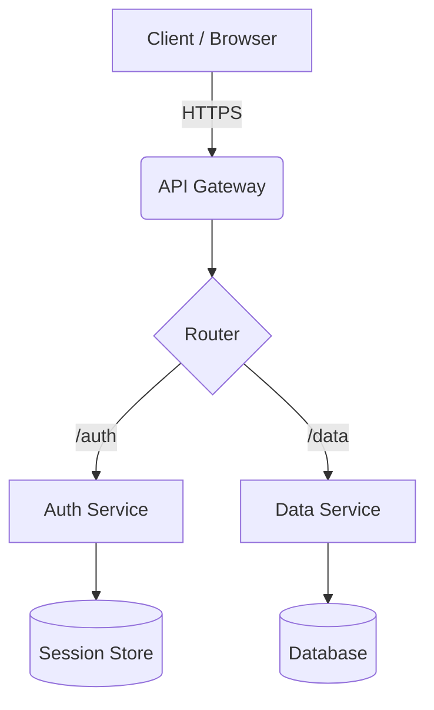

# Project Title

> One-sentence description of what this builds and why it matters.

**Status:** `in-progress` · **Started:** YYYY-MM-DD · **Shipped:** —

---

## Problem Statement

*What pain or gap does this solve? Who is the user?*

---

## Architecture

> Replace the diagram above with your actual system. Use `graph TD` for top-down, `graph LR` for left-right. Add a `sequenceDiagram` block below if you need to document request flows.

---

## Key Decisions

| Decision | Options Considered | Chosen | Reason |
|---|---|---|---|
| Database | Postgres / SQLite / DynamoDB | — | — |
| Hosting | Vercel / Fly.io / Self-hosted | — | — |
| Auth | JWT / Session / OAuth | — | — |

---

## Implementation Log

### YYYY-MM-DD — Milestone Name

*What was built. What broke. What you learned.*

### YYYY-MM-DD — Milestone Name

---

## Performance & Metrics

| Metric | Target | Actual |
|---|---|---|
| Lighthouse Performance | 95+ | — |
| p95 API Latency | < 200ms | — |
| Bundle Size | < 100kb | — |

---

## What I'd Do Differently

*Honest post-mortem. Write this after shipping.*

---

## Related

- [[projects/index|← All Projects]]
- [[learning/related-concept|Related concept note]]
